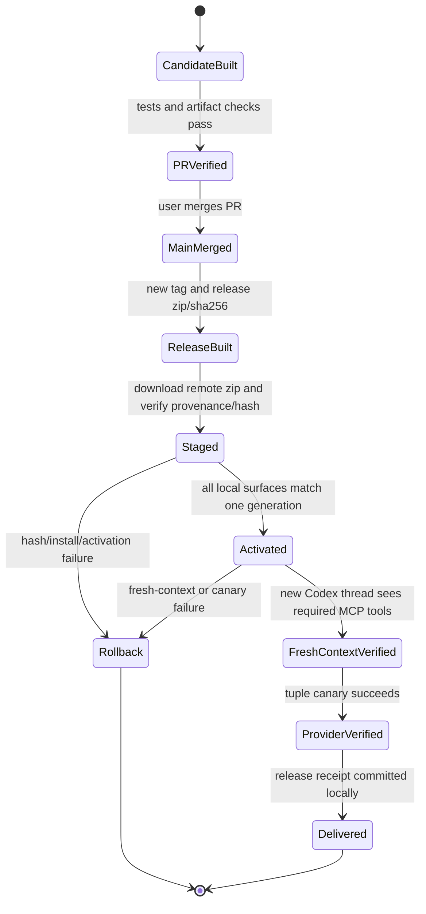

# Codex 执政官全链路发布治理与调研路由权重报告

日期：2026-07-16
项目：`D:\Projects\CodexPraetor`
性质：内部考古、外部证据调研、实施依据与接手收口记录
本轮边界：前置考古阶段不修改产品代码、安装态、分支、发布物或全局规则；接手实施阶段仅在 `codex/runtime-contract-readiness` 分支内补齐发布门禁、运行时合同和验证脚本，不覆盖当前用户 stable 安装态。

## 0. 接手实施更新

本报告的原始考古结论已经转化为当前分支实现：

1. `0.2.0-alpha` release zip 现在写入 `codex-praetor-release-generation.json`，记录版本、commit、runtime contract、Skill tree、plugin tree 和 required MCP tools。
2. `complete-codex-praetor-release.ps1` 的 stable stage 已改为从下载的 Release zip 解压后安装 Skill/plugin/cache，并写入 staged receipt；activation 只有在 fresh-context MCP proof 和 provider readiness 都匹配同一 generation 后才写 active receipt。
3. `get-codex-praetor-health.ps1` 已改为以 active receipt 为安装面权威，不再要求真实安装环境能看到开发源码树；installed Skill、plugin、cache、marketplace、fresh-context 和 provider readiness 不匹配时真实派工 fail closed。
4. runtime contract 的 `requiredMcpTools` 已从核心 9 个扩展为服务器实际注册的 17 个 `codex_praetor_*` 工具。
5. 外部研究路由已从一刀切禁止 worker 调研，收敛为 Codex/KR 主权威、worker 只在明确合同下做 readonly candidate discovery 或 independent replication。

## 1. 结论先行

### 1.1 对“版本混装是否已经根治”的直接回答

**原始考古时没有根治；当前分支已经补上 PR 前的主要治理闭环。** `codex/runtime-contract-readiness` 的 `0.2.0-alpha` runtime contract、health gate 和 provider canary 是必要的第一层：它能识别源码、插件和 cache 的部分不一致，并在缺少当前 cache generation 时拒绝真实派工。接手实施后，分支又补上 release generation manifest、artifact-first stage、active receipt、fresh-context proof 和 receipt-based health gate。

它在 PR 前仍不是“产品已交付”，原因是用户入口必须等 PR 合并后从最新 `main` 生成 GitHub Release zip，再下载远端 zip 做 stable closeout。当前已安装 plugin 和 personal cache 的历史观察说明问题不是理论风险，而是曾在现场存在；当前分支的职责是让这种混装不能再被 active receipt 和真实派工接受。

因此，下一步不应再做一次“把 cache 复制到最新版本”的补丁。应建立：

1. 唯一且不可变的 release generation；
2. stable 与 dev 两条明确分开的消费通道；
3. 合并后由 release closeout 驱动的 staged install、activation receipt、fresh-context MCP 验收和回滚；
4. 所有真实派工都以该 receipt 为准，任何分发面不匹配即 fail closed。

### 1.2 对“外部 worker 是否应被禁止调研”的直接回答

**不应一刀切禁止。** 当前 `external_research` 的路由把所有外部研究直接留给 Codex + KnowledgeRadar，并且建议 worker 只做本地代码工作。这是在上一轮事故后为避免弱证据替代主感知层而采取的过度收紧。

应替换为“**Codex/KR 主证据权威，worker 受控补充，Codex 最终综合**”的模型：

- Codex 先通过 KnowledgeRadar 建立研究路线、来源生态、问题边界和最低证据要求。
- 外部 worker 可以做限定范围的候选发现、实现线索搜集、竞争方案比对、独立复核或指定官方页面检索。
- worker 输出只能是带 URL、时间、摘录和不确定性的候选证据包，不能单独满足高风险事实、跨来源结论、用户决策建议或最终发布判断。
- Codex 负责核验、冲突消解、证据分级和最终结论。KnowledgeRadar 的通用调用规则只保留在全局规则和 KR skill，不应复制进每个 worker prompt。

这既保留 Codex 的高质量感知主线，也保留外部 worker 的并行覆盖价值。

## 2. 本轮证据、范围与当前状态

### 2.1 已核验的本地事实

| 事实 | 当前证据 | 含义 |
|---|---|---|
| 当前分支和提交 | `codex/runtime-contract-readiness`，`6ea726e` | 这是未合并的开发候选，不是已经交付给安装端的 stable。 |
| 源码 generation | `config/runtime-contract.json`、`plugin/.codex-plugin/plugin.json`、`plugin/mcp/package.json` 都为 `0.2.0-alpha` | 源码内部版本一致。 |
| 已安装 plugin | `C:\Users\ga990\plugins\codex-praetor\.codex-plugin\plugin.json` 为 `0.1.1-alpha` | 个人 marketplace 安装副本已落后。 |
| personal cache | `C:\Users\ga990\.codex\plugins\cache\personal\codex-praetor\0.1.1-alpha` 存在，未发现 `0.2.0-alpha` | Codex 实际可加载面仍可能是旧 MCP。 |
| 已安装 Skill | `C:\Users\ga990\.codex\skills\codex-praetor` 存在，最后写入时间晚于 plugin/cache | 已形成“新 Skill 指向新能力、旧 plugin/cache 实际提供旧能力”的典型混装条件。 |
| 当前健康门 | `get-codex-praetor-health.ps1` 检查 contract、active receipt、installed Skill/plugin/cache hash、marketplace、fresh-context MCP proof 和 provider readiness | 当前分支已把真实派工门禁从“源码对比”推进到“active receipt 对比”。 |
| 当前研究路由 | `mcp/src/route-intent.ts` 将主研究权威路由为 `codex_kr_primary_research`，仅在外部派工语义明确时允许 worker support | 它维护主感知层，同时保留受控补充调研空间。 |

### 2.2 历史直接根因

混装由“多个可独立成功的发布脚本”造成，而不是某一个文件复制失败：

1. `publish-codex-praetor-skill.ps1` 单独向 `%USERPROFILE%\.codex\skills\codex-praetor` 复制 Skill。
2. `publish-codex-praetor-personal-marketplace.ps1` 单独向 `%USERPROFILE%\plugins\codex-praetor` 复制 plugin，并单独修改 cachebuster。
3. `publish-codex-praetor-personal-cache.ps1` 单独向 `%USERPROFILE%\.codex\plugins\cache\personal\codex-praetor\<version>` 填充 cache。
4. Codex Desktop 的重新加载、从 marketplace 安装和新线程 MCP 工具发现又是额外步骤。

每个脚本内部都有临时目录、哈希比对、备份和局部回滚。这说明它们不是粗糙复制脚本；但它们之间没有共享 transaction、共同 generation ID、共同成功条件或最终 activation receipt。任一中断、漏跑、cache 不刷新、Desktop 未重载或新线程未验证，都会产生混装。

### 2.3 漏在了哪个开发阶段

根本缺口在**合并后的发布收口与本机消费端交付**，不在普通 feature 开发阶段。

开发分支的职责是构建 candidate 和证明源码正确；它不应悄悄覆盖用户的 stable 安装端。PR 合并表示源码进入主线，仍不等于用户取得了新版本。对于 Codex Praetor 这类插件/Skill/MCP 产品，必须再完成 release artifact、安装、激活和真实入口验收，才能称为产品交付。

此前流程把“各脚本都显示 PASS”误当成“消费端已完成收口”，没有把以下事项设为同一 release gate：远端 release zip、已安装 Skill、marketplace/plugin、副本 cache、当前启用版本、新 Codex 线程内可见的 MCP 工具集合、真实 provider tuple canary。

## 3. 为什么当前措施仍是补丁层，而不是长期治理

### 3.1 已有措施的价值

`0.2.0-alpha` 引入的 runtime contract 是正确的基础：它声明产品版本、wrapper protocol、task contract schema 和必需 MCP 工具集合。health 脚本会在 active receipt、installed surfaces、personal cache、fresh-context proof 或 provider readiness 不匹配时将状态标为 blocked，并明确要求真实派工拒绝。

这把“旧 cache 下新能力静默消失”的问题，从隐性错误转为可见阻断。它应保留并成为后续 generation receipt 的一个字段。

### 3.2 仍然缺失的治理部件

| 缺件 | 当前状态 | 需要的长期机制 |
|---|---|---|
| 单一 generation | 只有相同的语义版本，没有跨所有副本的 immutable build identity | `generation_id = version + commit SHA + artifact SHA256`，写入全部分发副本和 receipt。 |
| 可复现产物来源 | 有 zip/sha256，但安装副本不能反向证明来自哪个 release artifact | 由主线/tag 构建唯一 release zip，并在 receipt 记录 tag、commit、zip hash、文件清单 hash。 |
| 跨面激活 | 三段发布脚本分别替换目录 | 一个 release controller 先 staged copy 和校验，最后在 Desktop 关闭状态下执行受控 activation。 |
| 运行时实际面验收 | 静态版本和 cache 目录存在即可通过 | 新 Codex 线程读取 native MCP tool surface，确认必需工具集合与 generation 一致。 |
| 稳定/开发隔离 | 开发目录、C 盘安装端、personal cache 之间边界不足 | stable 默认只接受 GitHub Release；dev 仅在用户显式选择后安装 candidate，独立命名和 receipt。 |
| 可恢复性 | 每段脚本能局部回滚 | 保存上一个完整 stable receipt；activation 或 fresh-context 验收失败时回到上个 stable generation。 |

### 3.3 重要现实边界：不能承诺虚假的“跨目录原子替换”

Skill、plugin 安装根、cache 和 Desktop 进程不属于同一个事务系统。多个固定路径的 Windows 文件替换不可能天然成为一次跨路径原子事务。把三个 `Move-Item` 包在一个脚本里，也不等于原子发布。

因此目标必须定义为：**不允许任何混合 generation 通过 activation receipt 并接受真实派工**，而不是声称磁盘上永远不存在瞬时混合文件。正确流程是在关闭 Codex Desktop 后 staged install，确认全部 hash 后切换 activation state，重启 Desktop 并在新线程验证。若任何阶段失败，active receipt 仍指向上一 stable generation，新的运行时必须 fail closed。

## 4. 目标发布模型：从“复制脚本”变成 generation promotion

### 4.1 四种对象必须分开

| 对象 | 允许来源 | 是否可直接给用户使用 |
|---|---|---|
| 开发工作树 | 任意 `codex/*` 分支 | 否，只用于开发、单测和 candidate 构建。 |
| PR candidate | PR head 的构建产物 | 否，除非用户显式选择 dev channel。 |
| stable release generation | 已合并的 `main`、新 tag、GitHub Release zip 和 sha256 | 是，唯一默认安装来源。 |
| 本机 active generation | 已通过远端 zip 重装、fresh-context MCP、provider canary 的 stable receipt | 是，真实派工唯一允许的本机状态。 |

语义版本不足以表达“同一个版本号下来自哪一次构建”。每个 generation 至少包含：

```text
product=codex-praetor
version=0.2.0-alpha
tag=v0.2.0-alpha
commit=<immutable-main-sha>
artifact_sha256=<release-zip-sha256>
content_manifest_sha256=<file-tree-sha256>
build_id=<version+short-sha+UTC-build-time>
```

其中 tag、commit 和 artifact hash 必须可反向验证；`build_id` 只用于区分本地安装尝试，不能替代不可变 tag。

### 4.2 安装与激活状态机



`release receipt` 不是状态文字，而是可读 JSON/Markdown 证据，至少记录：generation ID、远端 zip URL、hash 验证结果、每个安装面的文件 manifest hash、marketplace active entry、Desktop 版本/重启时间、fresh-context 工具名清单、provider tuple canary 结果、回滚 generation 和操作者/时间。它是发布收口的唯一完成条件。

### 4.3 stable/dev 双通道

- **stable**：默认消费端。只能从 GitHub Release 的 `codex-praetor-setup-*.zip` 安装；只接受已验收 receipt。
- **dev**：只用于显式选择试验候选的用户。必须带 branch/commit/generation 标识，不能覆盖 stable receipt，也不得自动成为个人默认 plugin。
- **禁止自动同步**：任何分支构建、`npm build`、测试或 Skill 调试均不得写入 stable Skill/plugin/cache。
- **回滚**：只允许回到上一份完整 stable generation，而不是分别手动拷回某个目录。

这个设计符合本项目“开发 checkout 不是已安装 Skill 路径、不能用 symlink 代替本地安装”的既有边界。

## 5. 谁在什么阶段做什么

### 5.1 开发与 PR 前

Codex 负责：在 `codex/*` 分支实现、单测、构建 candidate、检查源树内 contract/manifest/required MCP tools 一致；所有安装 smoke 使用临时 `HOME`，不得触碰 stable。CI 负责机械检查：版本、manifest、包内容、release builder、安装 smoke、故障注入和旧 cache 应被拒绝的负向测试。

用户负责：PR 页面创建、合并和必要的账号授权。此阶段没有“更新本机 stable 插件”的动作。

### 5.2 PR 合并后：发布收口

这是本问题必须新增的责任阶段，归属于发布影响 PR 的 closeout：

1. Codex 切回最新 `main`，确认合并 commit。
2. 创建新的不可变版本/tag，不覆盖旧 tag。
3. 构建 release zip、sha256、content manifest；必要时生成 GitHub artifact attestation。
4. 从 GitHub Release 重新下载 zip，校验 hash 和 tag/commit 关系。
5. 在干净临时根完成安装 smoke，再在用户 stable 通道 staged install。
6. 关闭并重新启动 Codex Desktop；在**新线程**读取真实 native MCP 工具面。
7. 对与 generation 绑定的 provider CLI/version/model/mode 运行 capability canary。
8. 写入 release receipt，才把状态标为“产品已交付”。

任一步失败，只能称“代码已合并，产品未交付”，并按 receipt 回滚或保持此前 stable。

### 5.3 规则归属

| 位置 | 应写什么 | 不应写什么 |
|---|---|---|
| 全局 `AGENTS.md` | 发布影响改动必须完成远端产物、真实用户入口和合并后 closeout；合并不等于交付。 | Codex Praetor 的具体目录、generation 字段、provider 名称或 KR 调用细节。 |
| 项目 `AGENTS.md` | stable/dev channel、generation receipt、fresh-context MCP、provider canary、禁止 branch 覆盖 stable。 | 每一次具体 release 的手工日志。 |
| 脚本与 CI | 实际构建、staging、hash 比对、receipt schema、故障注入、阻断机制。 | 依赖自然语言提示词来保证执行。 |
| 用户操作手册 | stable 安装、dev opt-in、回滚、如何识别 receipt。 | 内部 provider 密钥、私有路径或调试数据库。 |

## 6. 外部调研权重与证据权威模型

### 6.1 问题不在“是否能搜索”，而在“谁有结论权”

外部 worker 具备联网和推理能力，但其工具、账户、结果稳定性、上下文和提示词边界与 Codex/KR 不同。若直接把其摘要当最终事实，会绕过本项目已经建设的 KnowledgeRadar 感知、来源生态、降级记录和证据登记能力。

反过来，禁止全部 worker 调研会让 Codex 无法把低风险、可并行的候选发现和独立复核外包，损失成本与覆盖优势。应区分“执行检索”和“形成被产品采纳的结论”。

### 6.2 统一策略

| 任务类型 | Codex/KR 角色 | worker 是否可做 | 最终验收 |
|---|---|---|---|
| 本地仓库搜索、代码定位 | 可不调用 KR | 可以，常规 readonly/edit 合同 | Codex 读取 diff、测试和引用路径。 |
| 低风险外部候选发现 | 先建立 KR research route 和问题边界 | 可以，限来源/关键字/时间窗/数量 | worker 仅交候选 URL 包；Codex 选择后复核。 |
| 特定实现或竞品资料搜集 | Codex 定义 claim 和最低来源级别 | 可以，作为补充覆盖或独立复查 | 必须附 URL、访问时间、原文摘录、来源类型和不确定性。 |
| 事实核查、跨来源结论、用户决策建议 | Codex/KR 为主执行者 | 可以，但只做独立第二来源或反证搜集 | Codex/KR 交叉验证后才可写最终结论。 |
| 安全、法律、发布、账户、付费或登录态研究 | Codex/KR 主导并处理人工边界 | 默认不派；有明确允许时只做不触碰账户的公开发现 | worker 结果永远不足以单独通过。 |

### 6.3 写入任务合同的最小字段

不要把 KnowledgeRadar 的完整操作说明重复写进 worker prompt。产品只需增加高层 policy 字段，由 Codex 在编排时执行：

```json
{
  "task_kind": "external_research",
  "research_authority": "codex_kr_primary",
  "worker_research_mode": "candidate_discovery",
  "claim_scope": ["official release workflow", "plugin update mechanism"],
  "source_scope": ["official_docs", "maintainer_docs"],
  "freshness": "year",
  "evidence_acceptance": "supervisor_verified",
  "worker_output_required": ["url", "retrieved_at", "excerpt", "claim", "uncertainty"]
}
```

建议保留三个 worker 模式：

- `none`：不派外部研究；例如登录态、敏感账户或高风险决策。
- `candidate_discovery`：worker 找候选，不形成结论。
- `independent_replication`：worker 按 Codex 已定义的 claim 独立寻找支持或反证，仍由 Codex 最终裁决。

若 KR 主感知层不可用，系统应明确返回 `research_authority_unavailable`。worker 可以在用户接受的降级条件下产出候选发现，但不得把该降级输出标为“已完成外部事实核查”。

### 6.4 对现有路由的精确改法

原始考古时，`route-intent.ts` 在命中“外部调研、事实核查、KnowledgeRadar”等词后会短路到旧研究路由 key，并建议只派本地代码。接手实施后，当前分支已经改为：

1. 返回 `codex_kr_primary_research`，说明 Codex/KR 拥有路线和结论权；
2. 如果用户同时表达“拆分/派工”，返回一个 `worker_research_eligible` 标志和建议的受控模式，而不是直接拒绝；
3. dispatch 在缺少 Codex 研究合同或 evidence acceptance 字段时拒绝 `external_research`；
4. timeline/UI 显示“Codex/KR 主研究”“worker 候选发现/独立复核”“Codex 最终综合”，而不是仅显示某条 shell 命令；
5. 最终报告引用主证据与 worker 候选时必须区分来源强度和采用状态。

这实现了用户要求的“Codex 自身调研能力权重更高”，而不是重复硬编码 KnowledgeRadar 的全局规则。

## 7. 外部调研如何支持该设计

1. GitHub 官方 artifact attestations 文档将 release artifact 与 workflow、repository、environment、commit SHA、触发事件绑定，并强调 attestation 必须被验证才产生价值。它直接支持“不可变产物 + receipt + 验证”，但不能替代本机安装态验收。
2. SLSA 的 build levels 将可信构建和可追溯供应链分级；对本项目的可操作映射是：从可复现 release artifact 开始，再将产物、commit、安装记录和消费端验证连成链，而不是依赖手工复制成功提示。
3. Anthropic 的多 agent research 系统公开复盘采用 lead agent 拆分并监督并行子研究；这支持“主控规划/综合、worker 扩展搜索覆盖”，不支持把 worker 输出直接等同最终结论。
4. LangGraph supervisor 官方文档明确由 central supervisor 控制通信和 task delegation，支持自定义 handoff 内容以及完整/压缩 worker history；这支持给 worker 下发明确 research contract，并保留可审计的交接和输出，而非让 worker 自由替代主控。
5. KnowledgeRadar 当前能力声明也明确：`kr_research` 是重度研究的高层感知入口，搜索结果在正文提取或跨来源验证前只是候选。该规则应由 Codex 执行，并成为 worker 输出被采纳的门槛。

## 8. 本分支实施 PR 的范围与顺序

本轮已经按发布影响 PR 候选实施，范围只围绕下面两个治理闭环，没有夹带 provider 功能改造。合并后仍必须按发布边界从远端 release zip 完成真实入口复验，才能标记“产品已交付”。

### 8.1 PR 内工作包

1. 定义 `release-generation` 与 `release-receipt` schema，包含 version/tag/commit/artifact/file manifest/installation surfaces/fresh-context/canary/rollback。
2. 将三个独立 publish 脚本封装为一个 release controller：先 stage，校验所有副本，再 activation；保留旧 generation，失败不写 active receipt。
3. 建立 stable/dev channel 显式选择；candidate 不能覆盖 stable。
4. 扩展 health/readiness：校验 installed Skill file tree hash、plugin install manifest、cache、marketplace active entry、receipt generation，而非只检查目录存在。
5. 新增 native MCP fresh-context 验收接口和 release closeout runner；实际 Desktop 重启/新线程步骤需明确标为用户可见验收边界。
6. 为合并后 release 生成远端 zip 再下载复验，并接入 checksum；评估 GitHub artifact attestation 是否可用，若权限/仓库类型不满足则记录为 deferred，不阻塞最小 receipt 链。
7. 以 fault injection 覆盖每一个 stage 中断、旧 cache、旧 marketplace、错误 receipt、canary 失败和 rollback。
8. 将 `external_research` 短路路由替换为主权威 + worker 补充的 research contract；增加拒绝缺失 supervisor acceptance 的负向测试。
9. 更新项目 `AGENTS.md`、release checklist、安装/回滚文档和 UI timeline 表达。

### 8.2 验收矩阵

| 场景 | 通过条件 |
|---|---|
| 分支 candidate | 不触碰 stable 安装端；临时 HOME 安装 smoke 通过。 |
| 合并后 release | 新 tag、release zip、sha256、content manifest 对应同一 commit。 |
| 全链路安装 | Skill、plugin、marketplace、cache、receipt 的 generation/hash 一致。 |
| 新启动/新线程 | MCP 实际显示 contract 中所有 required tools。 |
| provider | generation 绑定的 CLI/version/model/mode canary 通过。 |
| 中断 | 激活失败不产生新 active receipt；上一 stable generation 仍可恢复。 |
| 调研派工 | worker 任务缺少 Codex/KR research contract 时被拒绝；有合同时只以候选或独立复核身份回传。 |
| 最终状态 | 只能在远端包重装、fresh-context、canary、receipt 全部完成后标注“产品已交付”。 |

## 9. 建议写入规则的文字

以下是建议文本，不是本轮已修改的规则。

### 9.1 全局规则候选

```text
对会改变用户安装、插件、Skill、MCP、发布包或真实入口的发布影响 PR：PR 合并只代表代码进入主线。合并后必须从不可变远端产物完成安装/更新，并验证用户真实入口；未完成则状态必须写为“代码已合并，产品未交付”。开发分支和候选构建不得自动覆盖用户 stable 安装端。
```

### 9.2 Codex Praetor 项目规则候选

```text
Codex Praetor 的 stable 安装只能来自已验证的 GitHub Release generation。每次发布必须产生并验证 release receipt，覆盖 release zip、commit、Skill、plugin、marketplace、personal cache、fresh-context MCP tool surface 和 provider tuple canary。跨安装面不存在天然原子文件事务；任何不完整 generation 不得获得 active receipt，也不得接受真实派工。dev channel 必须显式 opt-in，且不能覆盖 stable。

外部研究默认由 Codex + KnowledgeRadar 持有路线与最终结论权。外部 worker 可按 Codex 下发的 research contract 做候选发现或独立复核；其输出必须含来源与不确定性，且不能单独通过高风险、跨来源或用户决策型结论验收。
```

## 10. 最终判断

目前的 `0.2.0-alpha` 工作不是无效补丁：它已经把混装检测升级为 release generation、artifact-first stage、active receipt、fresh-context proof、provider readiness 和 receipt-based health 的 PR 候选闭环，也正确保护了 Codex/KR 主感知层。原先 `external_research` 的硬短路已改为“Codex/KR 主权威 + 受控 worker 补充”的 research contract 路线。

本分支完成到 PR 前时，应诚实标记为：**本地实现和候选包验证完成，PR 待创建；stable 消费端尚未升级，产品尚未交付。** 只有 PR 合并后从远端 release zip 下载、安装、fresh-context、provider readiness 和 receipt 全部通过，才能标记“产品已交付”。

## 附录：证据索引

详细证据登记见：[Codex执政官全链路发布治理与调研路由权重证据登记-2026-07-16.md](Codex执政官全链路发布治理与调研路由权重证据登记-2026-07-16.md)。
