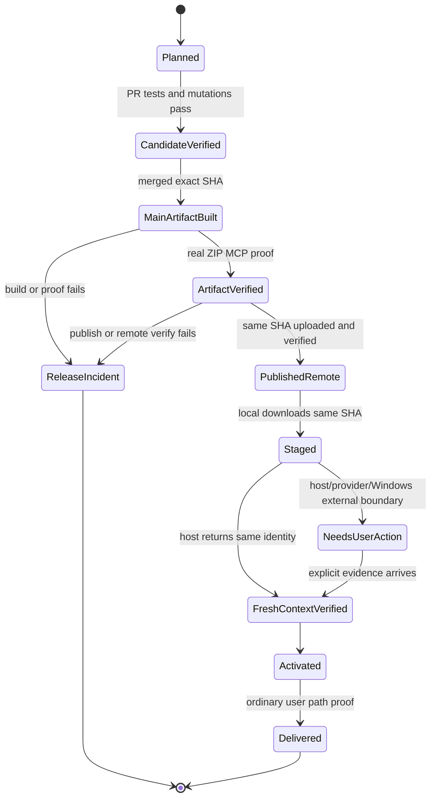

# Codex 执政官收口事故根因与交付保证体系研究报告

日期：2026-07-19
性质：只读考古与外部调研；本报告不修改产品代码、规则或 GitHub 设置。
问题：为什么已经连续数轮做了“收口修复”，仍会在 PR 合并后发现新问题；怎样从机制上终结这种循环。

## 1. 先说人话结论

之前反复出问题，不是因为少写了几条测试，而是因为项目把“同一件事”拆成了几份独立维护的副本，再让每个测试各看其中一份。每次修复只能让其中两三份对齐，剩下的一份继续藏着；等真正安装、启动或激活时，才暴露出来。

`0.6.2-alpha` 已经证明了这一点：它的 GitHub Release、zip 哈希、安装入口和 bundled MCP 启动都通过了，但**不能激活交付**。发布代际记录的是 18 个工具的合同，而用户实际启动的包内 MCP 会读到另一份只有 17 个工具的合同。因此 fresh-context proof 必然失败。这不是“再试一次 host 刷新”能解决的问题。

所以，不能诚实地承诺“以后任何外部错误都不会发生”——GitHub、网络、Windows 文件占用和 Desktop host 生命周期不受仓库控制。但可以把机制改到下面这个强度：

1. 仓库内的合同分叉、包与合同不一致、上传了未验收 artifact、伪造运行时证明，都会在 **PR 合并前失败**；
2. 合并后若遇到不可消除的外部故障，只能进入可见的 `release incident / needs_user_action`，不再被说成完成，也不允许带着半成品开始下一轮发布开发；
3. 发布器只能“晋升”已经验证过的那一份 zip，不能再构建一份看似相同、但没有经过同一套真实验收的包；
4. 每个已经发生过的事故都成为一个故障注入测试。以后改动若重新打开同一条通路，门禁会主动杀死它。

这才是把“收口后补丁循环”改成“发布前证明 + 失败状态机”的方法。它不是增加人工检查表，而是收掉多份真相源和多次无身份构建。

## 2. 当前事实：不是产品已交付

截至本次核验：

| 事实 | 已核验结果 | 结论 |
|---|---|---|
| 主线 | `main` = `21dfaa0`（PR #29） | 代码已合并 |
| 自动发布 | `Release On Main` run `29683550744` 成功 | 远端发布流程成功 |
| GitHub Release | `v0.6.2-alpha` 于 2026-07-19 发布；zip SHA-256 为 `08ce…a197` | 包已公开 |
| GitHub 不可变 Release | `isImmutable=false` | 远端尚未启用平台级不可变保护 |
| 0.6.2 stage receipt | `delivery.state=awaiting_host_refresh`，记录的合同 SHA 为 `1a402…a59d0` | 已 stage，未 activate/deliver |
| 当前 Desktop MCP | 实际仍加载 `0.6.1-alpha` | host 尚未刷新到目标代际 |
| 真正阻断 | 0.6.2 包内 runtime 返回 SHA `8a2c…0a14`，与 stage 所需 `1a402…a59d0` 不同 | 不能安全激活 |

因此当前唯一准确状态是：**代码已合并、Release 已公开、产品未交付（release incident）**。不能激活 `0.6.2-alpha`，也不能把它称作“只是 Desktop 没刷新”。

## 3. 根因链：到底是怎么漏掉的

### 3.1 历史引入点

提交 `a0b4ccc`（`0.5.0-alpha`）新增 `codex_praetor_governance_summary` 时：

- `config/runtime-contract.json` 增加了这个第 18 个工具；
- `mcp/src/server.ts` 也注册了它；
- `plugin/runtime-contract.json` 没有增加它。

之后的版本升级脚本只统一了版本号，没有把“工具集合必须逐项相同”设为不变量。于是分叉从 `0.5.0-alpha` 一直带到 `0.6.2-alpha`。

### 3.2 包里到底读哪一份合同

`mcp/src/paths.ts` 的运行逻辑是：先找 `<projectRoot>/config/runtime-contract.json`，不存在就回退到 `<projectRoot>/runtime-contract.json`。

在发布包中，MCP 的 `projectRoot` 是 `plugin/`：

```text
plugin/mcp/dist/server.js
  -> projectRoot = plugin/
  -> plugin/config/runtime-contract.json（不存在）
  -> plugin/runtime-contract.json（存在，17 工具）
```

同时，`scripts/release/get-codex-praetor-generation.ps1` 优先读取发布根目录的 `config/runtime-contract.json`（18 工具）。它们不是同一个身份。

真实启动 staged `0.6.2-alpha` 的 bundled MCP 已复验：服务端注册了 18 个工具，但 `runtime_info` 读到的合同只有 17 个工具、没有 `codex_praetor_governance_summary`，并返回 SHA `8a2c…0a14`。这精确解释了为什么 stage receipt 的 `1a402…a59d0` 无法通过 fresh-context proof。

### 3.3 为什么上一轮“最终 artifact 验收”仍放过了它

上一轮修掉的是另一条真实缺陷：旧的 `plugin/mcp/dist/server.js` 被复制到发布包。新门禁成功证明了“zip 能启动、server version 正确”。但它没有证明下列等式：

```text
canonical contract
  = package runtime actually reads
  = generation manifest records
  = stage/fresh-context expects
  = contract test asserts
```

具体漏点有三处：

1. `mcp/scripts/smoke-plugin-mcp.js` 维护一份手写 `requiredTools`，恰好没有要求 governance 工具，也没有读取权威合同。
2. `test-release-artifact-runtime.ps1` 只调用该 smoke；它验了“可启动”，没有比对 runtime_info 的合同 SHA、工具集合与 zip 内 generation manifest。
3. `test-release-closeout.ps1` 自己写出一份理想的 `observed-tools.json` 和 `runtime_info`，再让 proof 脚本读取它。它验证的是 proof 脚本能拒绝/接受模拟数据，不是最终 zip 的真实 MCP 是否能形成 proof。

这就是过去每一轮都“绿了但仍漏”的技术原因：测试之间没有共同的、只能读取的权威输入。

## 4. 还发现的第二个系统缺口：验收对象不是发布对象

当前 reusable pipeline 的顺序是：

```text
build-codex-praetor-release.ps1（默认 .codex-praetor/releases）
  -> test-release-artifact-runtime.ps1（验这个默认 zip）
  -> publish-github-release-asset.ps1 -OutputRoot .codex-praetor/ci-release
       -> 再次 build-codex-praetor-release.ps1
       -> 上传 ci-release 里的另一份 zip
```

仓库还有 determinism 测试，能比较两份临时构建的哈希，因此它降低了风险；但它没有让“已通过真实启动验收的文件”成为唯一可上传对象。只要构建环境、脚本分支、输出路径或未来的非确定性输入发生差异，验收过的 A 就可能与发布的 B 不同。

正确模型不是“同一源码可以多次重建”，而是：**一个 Release On Main run 只生成一个具身份的 artifact，所有后续步骤对它做验证、签名/attestation、上传和下载复验。** PR run 可以独立构建候选做预检；main run 必须自己一次性生成、验收并晋升同一个文件。

## 5. 三张真相表必须收成一张

| 领域 | 当前多个真相源 | 必须保留的唯一真相源 | 其他位置的职责 |
|---|---|---|---|
| MCP 合同 | `config/`、`plugin/`、两个 skill 目录、smoke 手写清单 | 一个 canonical contract | 其余均由生成器产出，不能手改 |
| 发布 artifact | 默认 `releases`、`ci-release`、determinism 临时目录、远端 zip | main run 的带 digest artifact | hash、attestation、Release 只引用该 digest |
| 运行时证明 | 手写 observed JSON、host runtime_info、stage receipt | 最终 zip 启动的 runtime_info 原始输出 | proof 只消费该输出并留下来源/哈希 |
| 交付状态 | GitHub Release、stage receipt、active receipt、health 文案 | 状态机收据（remote/local projection 分层） | 每一步只能前进，失败明确状态 |

这里的“唯一”不等于物理只存一份文件。它的意思是：只有一份可手改的来源；其他副本必须可再生、可比对、可拒绝漂移。

## 6. 新的交付保证体系

### 6.1 不可妥协的不变量

1. **合同单写入者**：工具列表、合同 schema、版本和兼容性只在 canonical source 修改。`plugin/`、`skill/`、zip 的合同由 `generate-runtime-surfaces` 生成；CI 对生成后树做 `git diff --exit-code`。
2. **双向真实合同验证**：从最终 zip 启动 MCP，读取 `listTools` 和 `codex_praetor_runtime_info`；同时验证：合同 SHA 相等、工具集合相等、server version 相等、runtime 的实际 contract path 位于该 zip 解压树内。不能只验证“缺工具”，也要拒绝“合同少了但 server 多注册了工具”。
3. **唯一 artifact 身份**：main release run 构建一次，赋予 `artifact_sha256`，后续 smoke、generation、attestation、Release 上传和远端下载验证全部使用这一 SHA。发布脚本禁止隐式 rebuild。
4. **证据不得伪造**：closeout integration test 必须由 final zip 启动 MCP 并采集 raw runtime_info；单元测试可以构造 JSON，但不能拿构造 JSON 作为“完整收口通过”的证据。
5. **状态只能前进**：`planned -> built -> artifact_verified -> published_remote -> staged -> fresh_context_verified -> activated -> delivered`。任何失败写明 `failed/blocked/needs_user_action`；不得跳过、不得用另一份文件代替、不得把失败隐去。
6. **故障必须可杀死**：每一宗历史事故对应至少一个 mutation；把已知坏状态故意放进临时副本，预期 gate 失败。若某事故无法映射到不变量和 mutation，说明设计未完成。
7. **下一轮开发前的硬边界**：若最近发布影响 PR 处于 release incident，则禁止开始下一次发布影响 PR；只能重跑原 SHA，或执行一份显式递增版本的恢复 PR。恢复 PR 本身必须完成本章所有门禁后才可合并。

### 6.2 建议的状态机



`ReleaseIncident` 与 `NeedsUserAction` 是合法、诚实的终态，不是“再开一个小 PR”的借口。前者优先重跑原 SHA；只有源码/合同本身有错、且旧 tag 已存在无法修正时，才创建新的递增版本恢复 PR。

## 7. 下一次恢复 PR 必须一次做完的工作

建议把它作为一个明确的 `0.6.3-alpha` 恢复与保证体系 PR；不要尝试重写 `v0.6.2-alpha`，也不要只改 `plugin/runtime-contract.json`。

### A. 收束合同与生成

1. 定义 canonical contract 的唯一位置和生成命令。
2. 让 plugin/skill 的合同副本由该命令生成；移除或禁止所有手写同步路径。
3. generator 同时派生 smoke 的 required tools，或 smoke 直接读取被测 zip 内 canonical contract；禁止维护第二份工具名单。
4. 增加 `verify-runtime-contract-surfaces`：比较 canonical、所有生成副本、运行时注册工具和 generation manifest，输出差异而非只看版本。

### B. 让真实 artifact 成为唯一发布对象

1. 把 release build 输出封装为 `artifact-manifest.json`：SHA、zip 路径、generation manifest SHA、commit SHA、canonical contract SHA、工具集合哈希。
2. `test-release-artifact-runtime` 接受明确 artifact manifest/zip 路径；运行时 proof 写回同一 manifest 的验证段。
3. 发布器只接受已经 `artifact_verified` 的 manifest，验证 SHA 后上传该文件；删除其内部 rebuild 行为。
4. 上传后下载远端资产，比较 SHA，再从下载包重新执行同一 runtime-contract proof。
5. 生成并校验 GitHub artifact attestation；它用于证明“此包由哪个 workflow/commit 生成”，但不替代上面的语义验证。

### C. 让 closeout 测试不再模拟成功

1. `test-release-closeout` 保留模拟输入的单元测试价值，但改名/拆分为 proof-parser unit test。
2. 新增真实 closeout integration：解压 final zip、启动其 bundled MCP、采集工具和 runtime_info、生成 proof、再 stage/activate 临时隔离 profile。
3. 对 host 生命周期只验证可观测状态与拒绝激活；不伪装成 CI 可以替真实 Desktop 刷新。

### D. 故障注入矩阵（合并前必须全部失败）

| 注入的已知坏状态 | 应由谁阻断 | 通过标准 |
|---|---|---|
| canonical 增一个工具，plugin contract 不变 | generated-surface gate | 明确报工具集合/SHA 差异 |
| server 注册工具与合同不同 | final runtime-contract proof | 明确报双向集合差异 |
| zip 内 contract 改字节但 generation 不变 | final artifact gate | 明确报 hash/manifest 不匹配 |
| runtime_info 来自旧/错误解压路径 | proof gate | 拒绝 path、SHA、generation identity |
| 验收 zip 与待上传 zip 不同 | publisher | 拒绝没有 verified manifest 或 SHA 不同的文件 |
| 修改 release 构建后试图直接上传 | workflow integration | 验证同一 artifact identity，不能出现第二次 rebuild |
| host 仍给旧版本 | fresh-context gate | 不 activate，状态为 needs_user_action |
| tag/Release 已存在但发布中断 | recovery integration | 只允许重跑原 SHA；禁止同版本新构建覆盖 |

### E. 规则和 GitHub 设置（在恢复 PR 设计中一并落地、但本报告不改）

项目规则应增加“合同单写入者、artifact manifest、真实 closeout proof、历史事故 mutation、发布器不得 rebuild”五项硬约束。全局规则只补一条跨项目原则：发布影响改动必须验证**上传的同一个 artifact**，而非只验证可由源码重建的另一个包。

GitHub 仓库目前 `isImmutable=false`；在确认现有 Release 管理策略后，应启用 immutable releases，并用 draft -> 上传全部资产 -> publish。还应把 attestation 的验签加入下载复验。它们加强“来源与不可篡改”，但不能替代合同/运行时语义门禁。

## 8. 外部调研如何支持这套设计

| 外部证据 | 得到的结论 | 对本项目的具体约束 |
|---|---|---|
| GitHub Immutable Releases | 发布后 tag/asset 不可修改；建议 draft、上传完整资产、再 publish | 已发布的坏 `0.6.2-alpha` 不应静默覆盖；恢复版本必须递增 |
| GitHub Artifact Attestations / SLSA | provenance 说明来自哪个 workflow/commit；官方明确它不保证 artifact 语义正确 | attestation 是 artifact manifest 的补强，不可当作 runtime contract test 的替身 |
| Reproducible Builds | 同源码、环境、指令应产生逐字相同 artifact；比较应基于 hash | 保留 determinism gate，但不能用它代替“上传就是已验收对象” |
| Pact provider verification | 合同必须由本地/CI 中实际运行的 provider 验证；不要用已部署服务或过度 stub 代替 | bundled MCP 必须从 final zip 真实启动，不能只使用手写工具清单或模拟 runtime_info |
| MCP lifecycle specification | 初始化时协商版本与能力；正常运行只能使用已协商能力 | host refresh 是有状态边界，不能假设文件替换会改变既有对话的工具快照 |
| VS Code Extension Testing | 成熟扩展用隔离 Extension Development Host 做 integration test | 当前隔离 profile + final artifact 启动方向正确；应把它升级为真实 proof，不是更长的 unit smoke |
| Google Canary Analysis Service | canary 是有限部署后按可观测指标决定前进、回滚、告警或等待人工 | 本机 host/provider 验证是“受控 canary 投影”，失败需显式状态而不是假装自动完成 |

学术 DOI `10.1002/stvr.1675` 的正文在本环境被 403 阻断，未作为强正文证据；Mutation Testing 的方法性结论由可访问的 OpenAlex/开放文献交叉支持。该访问限制已登记，未用搜索摘要替代正文。

## 9. 什么可以保证，什么不能保证

**可以在恢复 PR 中机械保证的事：**

- 所有可写合同副本和最终运行时不会悄悄分叉；
- 上传的 artifact 必然是被本次 run 的真实 runtime proof 验收过的同一 SHA；
- 过去已知的事故路径都会有会失败的 mutation；
- 失败不会被模糊标成“收口完成”，也不会被同版本补发掩盖。

**不能由代码保证、但必须有固定处理法的事：**

- GitHub API/runner/网络/权限失败：`release incident`，原 SHA 重跑；
- Desktop 未刷新或工具仍缓存旧代际：`needs_user_action`，不 activate；
- Windows 文件占用、杀毒、provider 登录：保留旧代际和恢复动作，不能假报清理或交付成功。

换句话说，目标不是不让宇宙发生错误，而是让任何错误都不能越过交付门槛，不能变成“用户合并后才发现、再开小补丁”的隐性尾巴。

## 10. 当前建议

1. 立即把 `0.6.2-alpha` 维持在 incident 状态，不激活、不交付、不宣布完成。
2. 不开始任何无关的发布影响开发。
3. 下一次只开一份恢复 PR，并按第 7 节把合同、artifact identity、真实 closeout proof、mutation 和规则收口同时完成。
4. 该 PR 合并后，按新状态机收口；如果是外部边界失败，停在 incident/needs_user_action，不再用新的“收口修复 PR”掩盖它。

本报告完成后，研究阶段结束；是否进入这份恢复 PR 的实现，需要用户明确授权。
